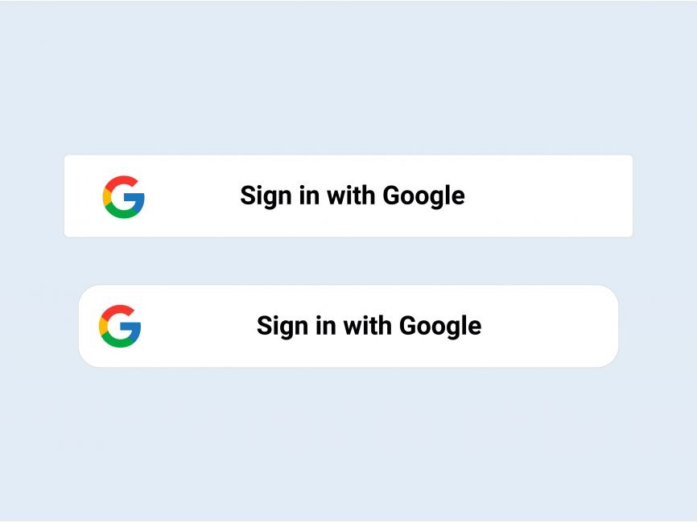
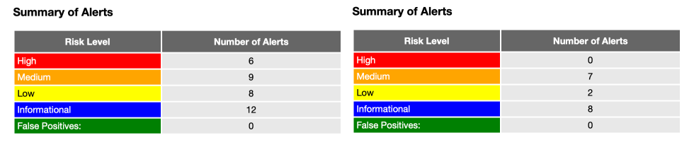

In the ever-evolving world of tech, getting your web app through Google’s stringent review process can feel like navigating a labyrinth. But fear not, dear readers! Today, I’m here to share our journey of how we, at AIWIZE, successfully passed Google’s OAuth verification and security review process. Spoiler alert: it involved a lot of back-and-forth emails, security enhancements, and a touch of humor to keep our sanity intact.

### What We Wanted

Our mission was simple (or so we thought): we needed our Autopilot feature to gain access to Google Drive and Sheets through OAuth. This would allow our users to seamlessly integrate their workflows with our app, boosting productivity and convenience.

### Google’s Inquisition: What They Asked

Google’s review team didn’t just ask—they grilled us like detectives on a crime drama. Here’s a breakdown of their key demands:

1. **Justification for Each Scope Requested:** Google wanted to know why we needed each permission scope we were requesting. They asked for a detailed explanation, which was fair because handing out broad permissions is a security risk.

2. **Demo Video:** we had to create a demo video showcasing how our app uses the requested scopes. This was a fun (read: slightly stressful) exercise in showing our app’s real-world use cases.

3. **Security Review:** Google requested a thorough security review of our app, including a DAST (Dynamic Application Security Testing) scan. They identified issues tied to specific CWEs (Common Weakness Enumerations) and demanded these be addressed.

4. **Code and Configuration Review:** for certain requirements like ensuring files from untrusted sources are scanned for malware, Google wanted to know if our third-party services adhered to these controls.

5. **Details of Public Application and GCP Project:** they needed the public-facing URL, the correct name of our application, and the exact GCP Project Number. Any mismatch here could delay the entire process.

6. **Branding Guidelines Compliance:** Google required us to update our UI styles to ensure all sign-in buttons featured explicit Google branding.

### Our Responses and Actions

Now, let’s talk about how we tackled these requests with the grace of a tightrope walker (and sometimes, the panic of one too).

1. **Scope Justification:** we provided detailed explanations for each permission scope, highlighting how it was critical for our app’s functionality. This wasn’t just about satisfying Google; it was about demonstrating our commitment to user security.

2. **Creating the Demo Video:** we put on our director’s hats and produced a video that showcased our app’s features in action. It was like making a mini-movie, complete with retakes and bloopers.

3. **Security Review with ZAP Proxy Attack Tool:** we conducted a comprehensive security analysis using the ZAP Proxy Attack Tool to identify vulnerabilities in our web applications. This process involved extensive surveys and updates to our security layers, including robust input validation, enhanced authentication and authorization mechanisms, strengthened session management and rate limiting, adherence to CORS and CSP policies, and fine-tuning of our HTTP security headers. Additionally, we provided detailed responses to Google's inquiries about specific security issues, ensuring our configurations met standards for CWEs like CWE-311, CWE-319, and CWE-524.

4. **Third-Party Service Compliance:** we clarified that our app does not handle files directly but processes data through URLs provided by users. These files are then processed by third-party services like Google Sheets, ChatGPT, and Discord, all of which are trusted and widely verified.

5. **Confirming Public Details:** we confirmed our app’s public URL, name, and GCP Project Number. This involved some minor mix-ups and a few “oops” moments, but we got it right in the end.

6. **Branding Guidelines Compliance:** we modified our UI to incorporate Google branding on all sign-in buttons and provided a demo video to show the updated sign-in button styles in action.

### The Hilarious Moments

No epic journey is complete without its lighter moments. Here are a few that kept our spirits high:

1. **The Never-Ending Email Thread:** Our inboxes became the digital version of an endless scroll. Every time we thought we’d answered the last question, a new one popped up. It was like playing whack-a-mole.

2. **Video Outtakes:** Creating the demo video was a riot. From accidentally sharing our Spotify playlist instead of the app’s functionality to our developer’s cat making a guest appearance, it was a comedy of errors.

3. **Security Jargon Overload:** At one point, we considered making a bingo card with all the security terms. “Did someone say ‘CWE-524’? Bingo!”

### Conclusion: The Sweet Taste of Success

After weeks of meticulous work, countless emails, and a few laughs along the way, we finally received the green light from Google. Our app was verified, secure, and ready to provide users with a seamless experience.

For any developers or managers embarking on this journey, remember: patience, thoroughness, and a sense of humor are your best allies. Navigating Google’s review process is no small feat, but with persistence and a clear focus on security, it’s entirely achievable.

So here’s to passing Google’s review with flying colors! Now, let’s get back to making awesome apps. Cheers!
